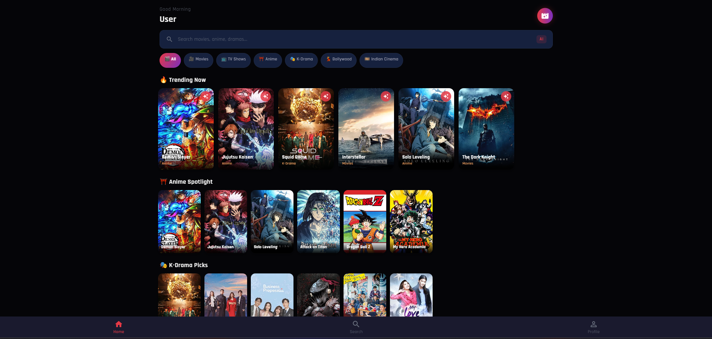
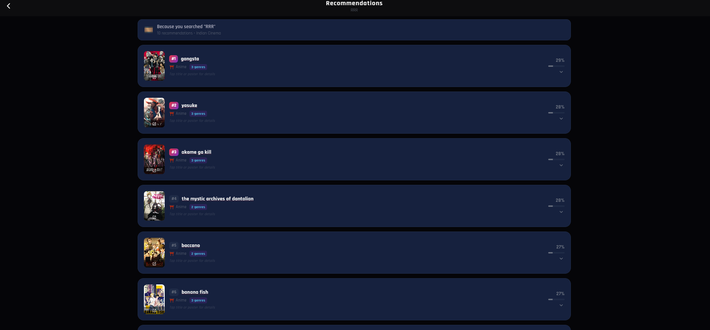
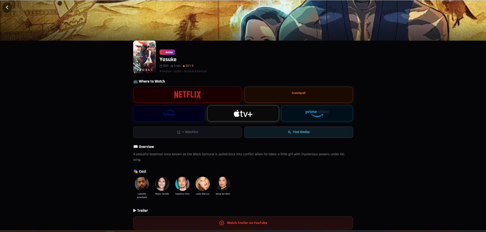
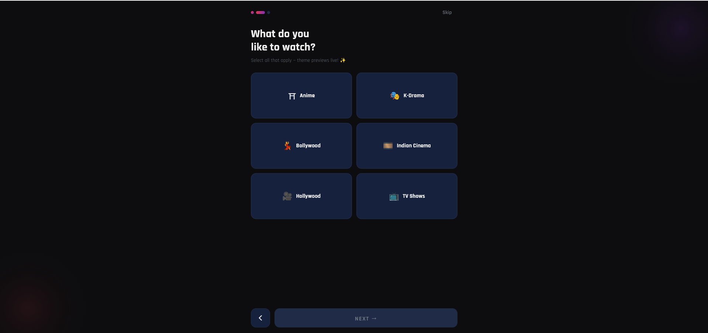
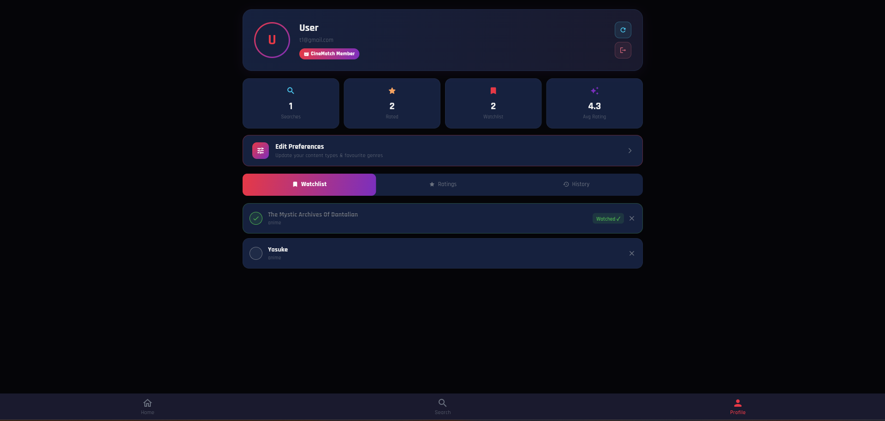
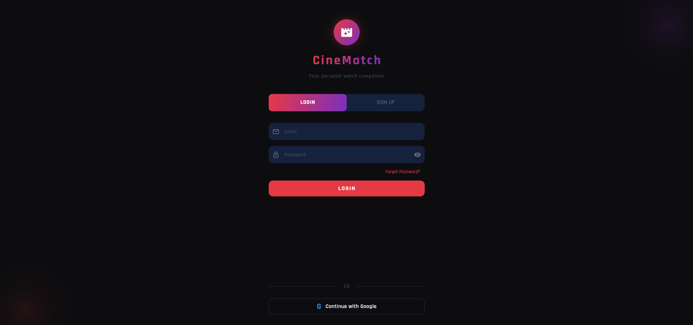

# 🎬 CineMatch

**Your AI-Powered Watch Guide** — personalized recommendations across Anime, K-Drama, Bollywood, Indian Cinema, Hollywood Movies & TV Shows.

CineMatch is a full-stack content discovery app that uses a hybrid SBERT + TF-IDF recommendation engine to help you find your next favorite watch — no matter what corner of global entertainment you love.

<p align="center">
  
  
  
  
</p>

<p align="center">
  <a href="https://cinematch-v2-e3f6a.web.app/"><strong>🔗 Live Demo →</strong></a>
</p>

> ⚠️ The backend runs on Render's free tier, so the first request after a period of inactivity may take 30–50 seconds to "wake up." Subsequent requests will be fast.

---

## 📸 Screenshots

> _Add your screenshots/GIFs here once available_

| Home | Recommendations | Detail Screen |
|------|------------------|----------------|
|  |  |  |

| Onboarding | Profile | Authentication |
|-----------|---------|-------------------|
|  |  |  |

---

## ✨ Features

- 🤖 **AI-Powered Recommendations** — hybrid SBERT (semantic) + TF-IDF (keyword) similarity engine trained on ~42K titles
- 🌏 **6 Content Universes** — Anime, K-Drama, Bollywood, Indian Cinema, Hollywood Movies, TV Shows
- 🎨 **Dynamic Theming** — 6 unique color themes that shift based on your favorite content type (Sakura Dark, Seoul Rose, Mumbai Gold, Kollywood Fire, Noir Silver, Emerald Night)
- 🔍 **Smart Search** — fuzzy matching, alias resolution, and typo correction (e.g. "spiderman" → "Spider-Man: No Way Home")
- 📺 **Where to Watch** — one-tap search links to Netflix, Crunchyroll, Disney+, Apple TV+, and Prime Video with official logos
- 🎞️ **Rich Detail Pages** — cast, trailers, overview, genres, and ratings pulled live from TMDB
- ⭐ **Rate & Review** — star ratings with optional written reviews, feeding back into your taste profile
- 📑 **Watchlist** — save titles to watch later, mark as watched
- 🕘 **Search History** — revisit and re-run past searches
- 🔄 **Editable Preferences** — update your favorite genres/content types anytime, with full preference history preserved in Firestore for future ML use
- 🔐 **Firebase Auth** — Email/Password and Google Sign-In

---

## 🏗️ Tech Stack

### Frontend
| Technology | Purpose |
|---|---|
| **Flutter** | Cross-platform app (Android + Web) |
| **GetX** | State management, routing, dependency injection |
| **Dio** | HTTP networking with timeout & retry handling |
| **cached_network_image** | Image caching for posters/backdrops |
| **flutter_rating_bar** | Star rating UI |
| **flutter_svg** | Official streaming platform logos |
| **url_launcher** | Deep-linking to streaming platforms & trailers |
| **Google Fonts (Rajdhani)** | Primary typography |

### Backend
| Technology | Purpose |
|---|---|
| **FastAPI** | REST API serving recommendations |
| **Sentence-BERT (all-MiniLM-L6-v2)** | Semantic similarity embeddings |
| **scikit-learn (TF-IDF)** | Keyword-based similarity |
| **RapidFuzz** | Fuzzy title matching & autocomplete |
| **Pandas / NumPy** | Data processing |
| **Render (Free Tier)** | API hosting |

### Database & Auth
| Technology | Purpose |
|---|---|
| **Firebase Auth** | Email/Password + Google Sign-In |
| **Cloud Firestore** | User data, ratings, watchlist, preferences, search history |
| **Firebase Hosting** | Web app deployment |

### External APIs
| API | Purpose |
|---|---|
| **TMDB (The Movie Database)** | Poster images, metadata, cast, trailers |

---

## 🧠 How the Recommendation Engine Works

The recommender combines two complementary similarity approaches on a cleaned dataset of ~42,000 titles spanning movies, TV, anime, K-drama, Bollywood, and regional Indian cinema:

1. **SBERT Embeddings (semantic)** — captures thematic/contextual similarity from overview, cast, director, genres, and cultural tags
2. **TF-IDF (keyword)** — captures exact keyword/genre overlap
3. **Hybrid Score** — `0.6 × SBERT + 0.4 × TF-IDF`, further weighted with genre overlap and popularity

A **5-step fallback chain** ensures recommendations are never empty — progressively relaxing content-type and similarity constraints, down to a popularity-based fallback as a last resort.

Title resolution handles real-world messiness: typos, spacing issues ("onepiece" → "one piece"), and aliases (slang/abbreviations like "jjk" → "Jujutsu Kaisen").

---

## 📂 Project Structure

```
cinematch/
├── lib/                          # Flutter app
│   ├── controllers/              # GetX controllers (auth, search, theme, recommendations)
│   ├── core/                     # Constants, theming, utils
│   ├── models/                   # Data models
│   ├── screens/                  # UI screens (home, search, detail, profile, onboarding...)
│   ├── services/                 # API, TMDB, Firestore service layers
│   ├── widgets/                  # Shared widgets
│   └── main.dart                 # App entry point & routing
│
├── backend/                      # FastAPI recommendation service
│   ├── main_v2.py                # API entry point
│   ├── phase_v2.ipynb            # Data preprocessing & model training notebook
│   ├── artifacts/                # Trained model artifacts (generated, not committed)
│   └── tmdb_dataset.csv          # Raw dataset
│
├── android/                      # Android platform files
├── web/                          # Web platform files
└── README.md
```

---

## 🚀 Getting Started

### Prerequisites

- Flutter SDK 3.x ([install guide](https://docs.flutter.dev/get-started/install))
- Python 3.10 or 3.11
- A Firebase project (Auth + Firestore enabled)
- A free [TMDB API key](https://www.themoviedb.org/settings/api)

---

### 1️⃣ Backend Setup (FastAPI)

```bash
cd backend

# Create virtual environment
python -m venv venv
source venv/bin/activate        # Windows: venv\Scripts\activate

# Install dependencies
pip install fastapi uvicorn pandas numpy scikit-learn rapidfuzz \
            sentence-transformers firebase-admin python-multipart
```

**Generate the model artifacts** by running through `phase_v2.ipynb` — this preprocesses `tmdb_dataset.csv`, builds the TF-IDF matrix, generates SBERT embeddings, and saves everything into an `artifacts/` folder.

**Run the API locally:**

```bash
uvicorn main_v2:app --reload --port 8000
```

The API will be available at `http://localhost:8000`. Visit `http://localhost:8000/docs` for interactive Swagger documentation.

**Environment variables (optional, for feedback storage):**

```bash
export FIREBASE_KEY='<your-firebase-service-account-json-as-string>'
```

#### Deploying to Render (Free Tier)

1. Push the `backend/` folder to its own repo (or configure root directory in Render)
2. Create a new **Web Service** on [Render](https://render.com)
3. Build command: `pip install -r requirements.txt`
4. Start command: `uvicorn main_v2:app --host 0.0.0.0 --port $PORT`
5. Add `FIREBASE_KEY` as an environment variable if using feedback storage

> ⚠️ **Render free tier note:** the service sleeps after 15 minutes of inactivity. The first request after idle can take 30–50 seconds to "wake up" — the Flutter app is already configured with a 60-second timeout and a friendly "waking up" message to handle this gracefully.

---

### 2️⃣ Frontend Setup (Flutter)

```bash
# Install dependencies
flutter pub get
```

**Configure Firebase:**

```bash
# Install FlutterFire CLI if you haven't
dart pub global activate flutterfire_cli

# Connect your Firebase project
flutterfire configure
```

This generates `lib/firebase_options.dart` — **do not commit this file with real credentials to a public repo.**

**Add your TMDB API key** in `lib/core/constants/app_constants.dart`:

```dart
static const String tmdbApiKey = 'YOUR_TMDB_API_KEY_HERE';
```

**Point the app to your backend** (same file):

```dart
static const String baseUrl = 'https://your-render-app.onrender.com';
```

**Run the app:**

```bash
# Android
flutter run

# Web
flutter run -d chrome --web-port 5000
```

#### Android — Manifest Requirements

Ensure `android/app/src/main/AndroidManifest.xml` includes:

```xml
<uses-permission android:name="android.permission.INTERNET"/>
<queries>
    <intent>
        <action android:name="android.intent.action.VIEW" />
        <data android:scheme="https" />
    </intent>
</queries>
```

This is required for `url_launcher` to open streaming platform links and trailers on Android 11+.

---

## 🔐 Environment & Secrets

This is a public repository. Before pushing your own changes, make sure the following are **never committed with real values**:

| File | Sensitive Content |
|---|---|
| `lib/core/constants/app_constants.dart` | TMDB API key |
| `lib/firebase_options.dart` | Firebase project credentials |
| Backend environment variables | `FIREBASE_KEY` service account JSON |

Consider using `--dart-define` flags or a `.env` loader for production builds instead of hardcoded constants.

---

## 🗺️ Roadmap

- [ ] **Daily Pick** — one personalized recommendation per day based on rating history and taste profile
- [ ] Streak system for daily engagement
- [ ] Taste evolution tracking (genre/type drift over time)
- [ ] "Because you rated X" dynamic home sections
- [ ] Weekly personalized digest
- [ ] Social features (friend activity, shareable taste cards)

---

## 🤝 Contributing

This project started as a personal portfolio build and is currently maintained solo. Issues and suggestions are welcome — feel free to open an issue to discuss before submitting a PR.

---

## 📄 License

This project is open source. Add your preferred license (MIT recommended for portfolio projects) as a `LICENSE` file in the repo root.

---

## 🙏 Acknowledgements

- [TMDB](https://www.themoviedb.org/) for the movie/TV metadata and images
- [Sentence-Transformers](https://www.sbert.net/) for the SBERT embedding model
- [RapidFuzz](https://github.com/rapidfuzz/RapidFuzz) for fuzzy title matching

---

<p align="center">Built with ❤️ by Saransh</p>
